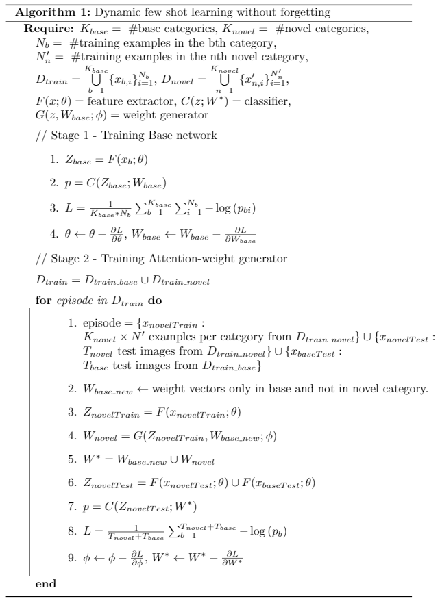
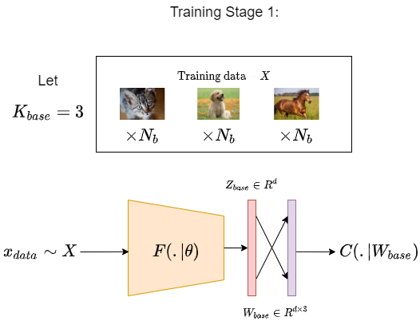
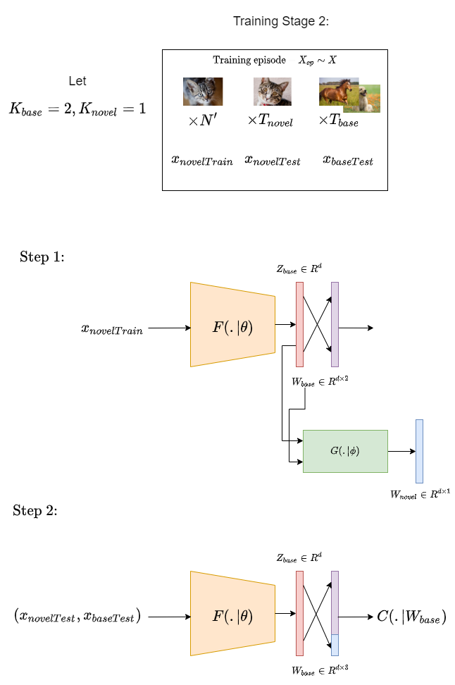
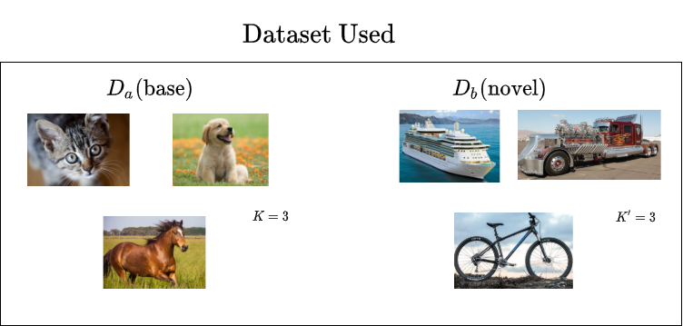
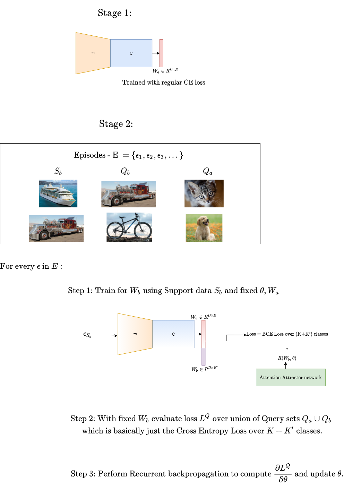

# An overview of Incremental few shot learning methods.

The area of few shot learning addresses the problem of how to use only few samples from a particular class and learn to classify it as opposed to using 100s or 1000s of samples. This problem in itself is not practically very useful, because one would not want a classifier to learn new classes by erasing previous knowledge, but rather add to it. This has given rise to the area of Incremental Continual Learning. We will now review some papers in this area, understand the philosphy of their idea and walk through the technical details of the contributions. 

We will consider the following 5 papers:

1. [Dynamic Few-Shot Visual Learning without Forgetting](https://arxiv.org/abs/1804.09458)
2. [Incremental Few-Shot Learning with Attention Attractor Networks](https://arxiv.org/abs/1810.07218)
3. [XtarNet: Learning to Extract Task-Adaptive Representation for Incremental Few-Shot Learning](https://arxiv.org/abs/2003.08561)
4. [Few-Shot Class-Incremental Learning](https://arxiv.org/abs/2004.10956)
5. [Incremental few-shot learning via vector quantization in deep embedded space ](https://openreview.net/forum?id=3SV-ZePhnZM)

## Paper 1 - Dynamic Few-Shot Visual Learning without Forgetting

The main goal of this work is to develop a framework so as to learn new classes with few samples while not forgetting the old classes. There are two main technical contributions to achieve this goal: 
* Have a few-shot classification weight generator to extend the object clasifier into learning new classes. 
* Redesign classifier into using cosine similarity instead of dot product.

The algorithm proposed by the paper is shown below: 

A pictorial representation of their training process is also shown below: 

## Paper 2 - Incremental Few-Shot Learning with Attention Attractor Networks

This paper uses meta learning to be able to perform few shot learning. The train dataset is initally divided into base-classes and novel classes. In the first stage, the base classes are learned with a base neural network. In the second stage, "episodes" with data from new and old classes are formed and meta learning is used to learn the parameters of the attention attractor network (AAN). Finally, in the inference stage, with fixed parameters of AAN, the weight matrix for the novel classes can be obtained by simple SGD based training. 

Pictorial representation of the training process is shown below: 

